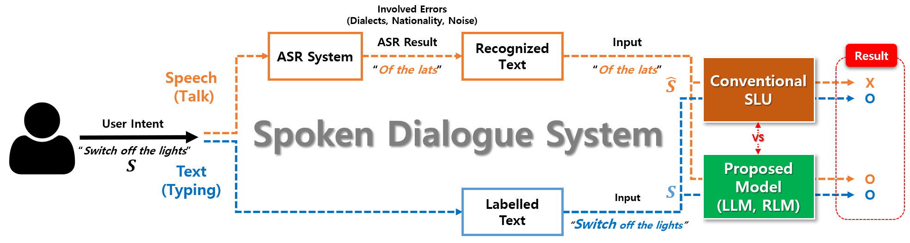

# "Improved Spoken Language Representation for Intent Understanding in a Task-Oriented Dialogue System"

## Official code of Improved Spoken Language Representation for Intent Understanding in a Task-Oriented Dialogue System

<div align="middle"></div>

#### Authors: June-Woo Kim, Hyekyung Yoon, Ho-Young Jung
#### This paper was published in [Sensors](https://www.mdpi.com/1424-8220/22/4/1509), 2022
#### Abstract: Successful applications of deep learning technologies in the natural language processing domain have improved text-based intent classifications. However, in practical spoken dialogue applications, the users’ articulation styles and background noises cause automatic speech recognition (ASR) errors, and these may lead language models to misclassify users’ intents. To overcome the limited performance of the intent classification task in the spoken dialogue system, we propose a novel approach that jointly uses both recognized text obtained by the ASR model and a given labeled text. In the evaluation phase, only the fine-tuned recognized language model (RLM) is used. The experimental results show that the proposed scheme is effective at classifying intents in the spoken dialogue system containing ASR errors.

<div align="middle"></div>

# How to train?
## Proposed model (Dual pre-training)
### To run the proposed model with the respective BERT pre-trained model and Audio-Snips dataset,
`python main_proposed.py --gpus 0 --data_dir ./dataset/snips_audio --dataset_name all --dataset_name2 Audio-Snips --pretrained_model bert --ckpt proposed_all_bert_analysis`

### To run the proposed model with the respective ALBERT pre-trained model and FSC dataset,
`python main_proposed.py --gpus 0 --data_dir ./dataset/FSC --dataset_name FSC_dataset --dataset_name2 FSC --pretrained_model albert --ckpt proposed_fsc_albert_analysis`

### To run the proposed model with the respective XL-NET pre-trained model and specific speaker of Audio-Snips dataset (Salli),
`python main_proposed.py --gpus 0 --data_dir ./dataset/snips_audio --dataset_name Salli --dataset_name2 Audio-Snips --pretrained_model xlnet --ckpt proposed_salli_bert_analysis`

## Train with labeled dataset alone
`python main_s_train_alone.py --gpus 0 --data_dir ./dataset/snips_audio --dataset_name all --dataset_name2 Audio-Snips --pretrained_model bert --ckpt s_train_alone_all_bert_analysis`

## Train with recognized dataset alone
`python main_shat_train_alone.py --gpus 0 --data_dir ./dataset/snips_audio --dataset_name all --dataset_name2 Audio-Snips --pretrained_model bert --ckpt s_hat_train_alone_all_bert_analysis`

## Train with the respectively labeled dataset with masked probability (10-30%)
`python main_s_train_mask.py --gpus 0 --data_dir ./dataset/snips_audio --dataset_name all --dataset_name2 Audio-Snips --pretrained_model bert --ckpt s_train_mask_all_bert_analysis`

## Train with the respectively labeled dataset with a MIXUP approach
`python main_s_train_mixup.py --gpus 0 --data_dir ./dataset/snips_audio --dataset_name all --dataset_name2 Audio-Snips --pretrained_model bert --ckpt s_train_mixup_all_bert_analysis`

## Dataset
### In the dataset folder, we provide the labeled dataset (oracle) and the corresponding recognized dataset from wav2vec 2.0 model. Please check the respective train/valid/test CSV files.

## Bug / Reporting
### If any problem happens, do not hesitate to open the issue or give me the email (kaen2891@gmail.com)

## Citation
```
@Article{s22041509,
AUTHOR = {Kim, June-Woo and Yoon, Hyekyung and Jung, Ho-Young},
TITLE = {Improved Spoken Language Representation for Intent Understanding in a Task-Oriented Dialogue System},
JOURNAL = {Sensors},
VOLUME = {22},
YEAR = {2022},
NUMBER = {4},
ARTICLE-NUMBER = {1509},
URL = {https://www.mdpi.com/1424-8220/22/4/1509},
PubMedID = {35214405},
ISSN = {1424-8220},
DOI = {10.3390/s22041509}
}
```
